# Income Prediction (University Project)
Briefly describe the dataset and the goal of the project: predicting if an individual's income exceeds $50k based on census data.

---

## 👥 Team Members
| Name                       | Role                            |
|----------------------------|---------------------------------|
| Ahmed Abd El-Latif         | Team Leader & Random Forest Model      |
| Alaa Ashraf                | Cleaning The datasets & UI          |
| Moaaz Ibrahim              | KNN Model                       |
| Mona Saber                 | Encoding & Feature Engineering the datasets                  |
| Muhammed Khaled            | Visualization & Analysis & XGBoost Model        |
| Nada Mohamed               | Logistic & Decision Tree Models |
| Omar Ibrahim               | SVM Model                       |

---

## 🛠️ 1. Data Pipeline: Preprocessing & Encoding

Our pipeline focuses on **Information Density** and **Data Consistency**, transforming raw census data into a robust format for machine learning:

### 1.1 Data Cleaning & Imputation
*   **Missing Values:** Replaced `?` with `NaN` and implemented **Median imputation** for numerical columns and **Mode imputation** for categorical ones. This preserved dataset integrity without losing valuable rows.
*   **Outlier Management:** Applied **IQR Clipping** on `hours-per-week`. This "clipped" extreme values to a statistical boundary, preventing outliers from distorting the decision-making of linear models (Logistic/SVM).

### 1.2 Feature Engineering (Knowledge Injection)
We engineered specific features to highlight key socio-economic signals:
*   **`capital-net`**: Consolidated `capital-gain` and `capital-loss` into a single financial indicator.
*   **`marital-status`**: Simplified `marital-status` into a binary feature (1 for married, 0 for others), as marriage proved to be a strong predictor of higher income in this dataset.
*   **`is_us`**: Grouped `native-country` into US vs. Non-US to handle the sparsity and noise of rare country categories.
*   **`has-capital`**: A binary flag indicating whether an individual has any capital investment activity.

### 1.3 Categorical Encoding & Scalability
To ensure the models can process text data while maintaining stability during testing:
*   **Robust Label Encoding:** Used `LabelEncoder` for features like `occupation` and `workclass`. We implemented a **Safe Mapping Logic** for the test set:
    *   *Logic:* `test_df[col].map(lambda s: s if s in le.classes_ else le.classes_[0])`
    *   *Impact:* This prevents model crashes if the test set contains "Unseen Labels," by mapping unknown values to the most frequent class.
*   **Feature Selection:** Dropped `fnlwgt`, `education`, and `race` to reduce dimensionality and eliminate redundant noise.
*   **Feature Scaling:** Applied **StandardScaler** to all numerical features to ensure that variables with large ranges do not dominate distance-based algorithms like SVM and KNN.

---

## 📊 2. Data Analysis and Visualizaion

### Income Distribution

The first thing we looked at is the overall split between the two income groups.

As you can see, the dataset leans heavily toward the lower income group — about **75% earn $50K or less**, while **25% earn more than $50K**.

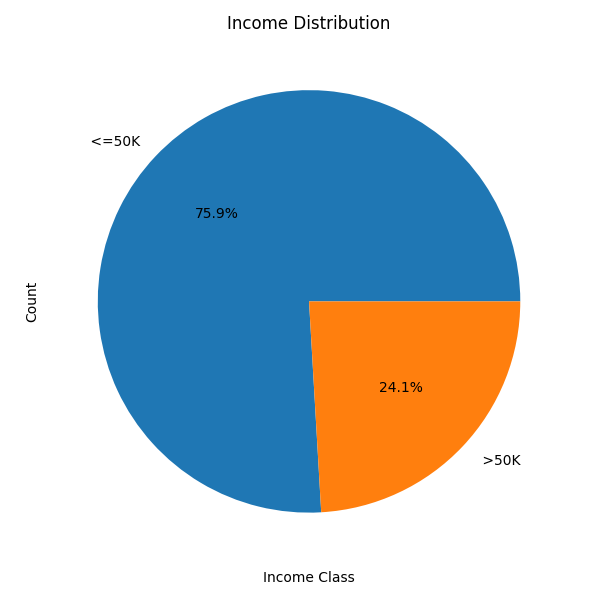

---

### Education and Income

Education is one of the strongest predictors of income.

The charts below show how the proportion of high earners rises sharply with education level.

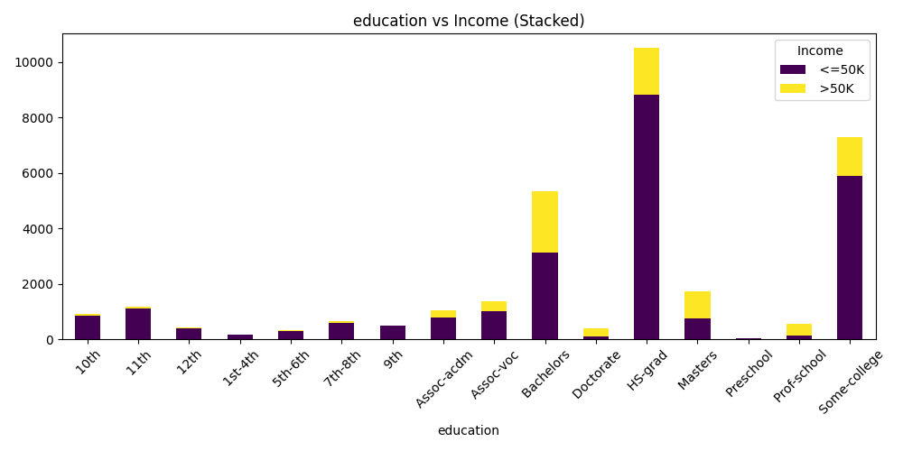

### High-Income Education Levels

<table width="100%">
<tr>
<th>Education Level</th>
<th>Earns <=50K</th>
<th>Earns >50K</th>
</tr>

<tr><td>Doctorate</td><td>25.9%</td><td><b>74.1%</b></td></tr>
<tr><td>Prof-school</td><td>26.6%</td><td><b>73.4%</b></td></tr>
<tr><td>Masters</td><td>44.3%</td><td><b>55.7%</b></td></tr>
<tr><td>Bachelors</td><td>58.5%</td><td>41.5%</td></tr>
<tr><td>Assoc-voc</td><td>73.9%</td><td>26.1%</td></tr>

</table>

**Key insight:** A Doctorate or professional school degree gives someone a nearly 3-in-4 chance of earning above $50K.

---

### Low-Income Education Levels

<table width="100%">
<tr>
<th>Education Level</th>
<th>Earns <=50K</th>
<th>Earns >50K</th>
</tr>

<tr><td>9th grade</td><td>94.7%</td><td>5.3%</td></tr>
<tr><td>11th grade</td><td>94.9%</td><td>5.1%</td></tr>
<tr><td>5th-6th grade</td><td>95.2%</td><td>4.8%</td></tr>
<tr><td>1st-4th grade</td><td>96.4%</td><td>3.6%</td></tr>
<tr><td>Preschool</td><td>100.0%</td><td>0.0%</td></tr>

</table>

**Key insight:** People with very low education levels have almost no representation in the high-income group.

---

### Age and Income

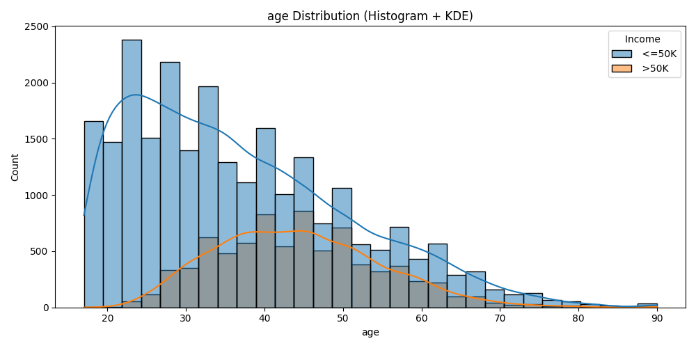

<table width="100%">
<tr><th>Income Group</th><th>Average Age</th></tr>
<tr><td>Earns <=50K</td><td>36.8 years</td></tr>
<tr><td><b>Earns >50K</b></td><td><b>44.2 years</b></td></tr>
</table>

**Key insight:** People in the higher income group are about **7–8 years older** on average.

---

### Working Hours and Income

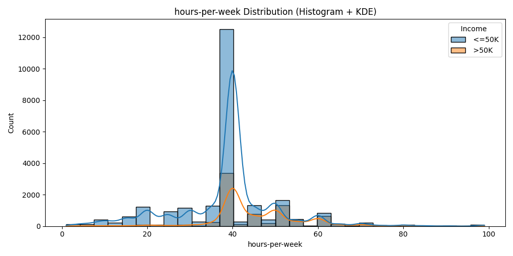

<table width="100%">
<tr><th>Income Group</th><th>Average Hours / Week</th></tr>
<tr><td>Earns <=50K</td><td>38.8 hours</td></tr>
<tr><td><b>Earns >50K</b></td><td><b>45.5 hours</b></td></tr>
</table>

**Key insight:** High earners work roughly **6–7 more hours per week**.

---

### Marital Status and Income

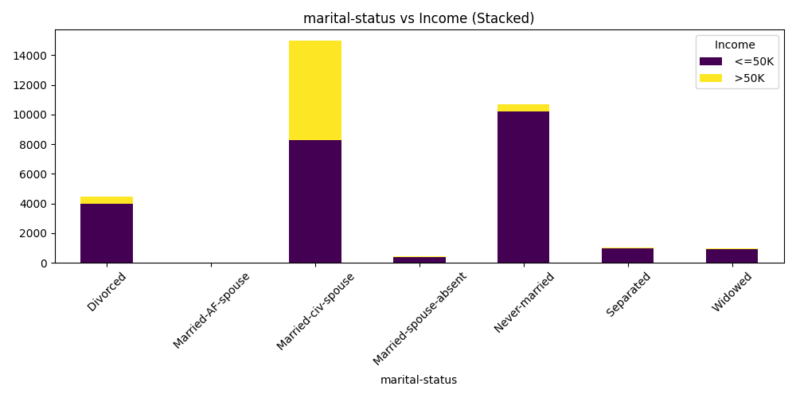

<table width="100%">
<tr>
<th>Marital Status</th>
<th>Earns <=50K</th>
<th>Earns >50K</th>
</tr>

<tr><td>Married-civ-spouse</td><td>55.3%</td><td><b>44.7%</b></td></tr>
<tr><td>Married-AF-spouse</td><td>56.5%</td><td><b>43.5%</b></td></tr>
<tr><td>Divorced</td><td>89.6%</td><td>10.4%</td></tr>
<tr><td>Widowed</td><td>91.4%</td><td>8.6%</td></tr>
<tr><td>Married-spouse-absent</td><td>91.9%</td><td>8.1%</td></tr>
<tr><td>Separated</td><td>93.6%</td><td>6.4%</td></tr>
<tr><td>Never-married</td><td>95.4%</td><td>4.6%</td></tr>

</table>

**Key insight:** Being married (especially to a civilian spouse) is closely linked to higher income.

---

### Occupation and Income

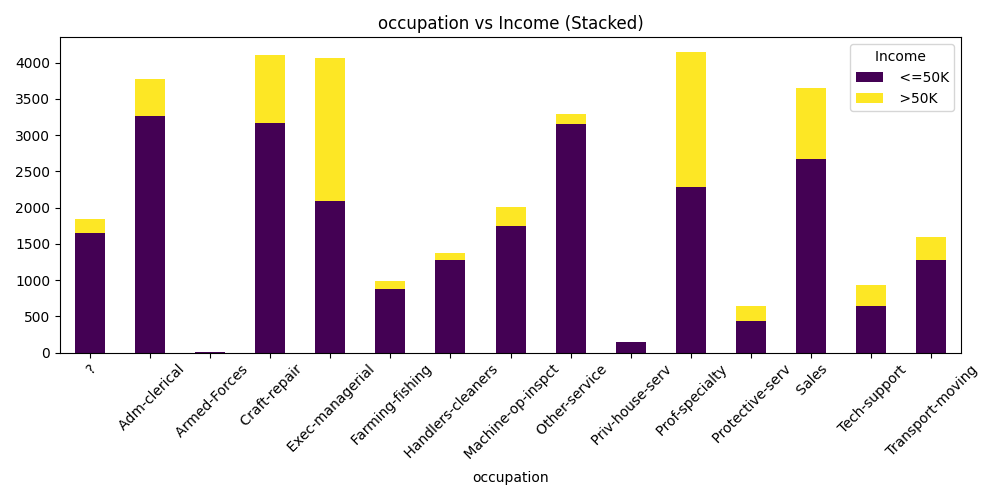

---

### Gender and Income

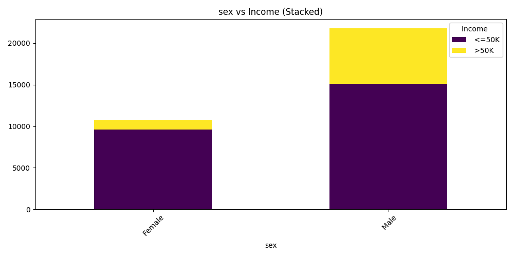

---

### Capital Gains and Losses

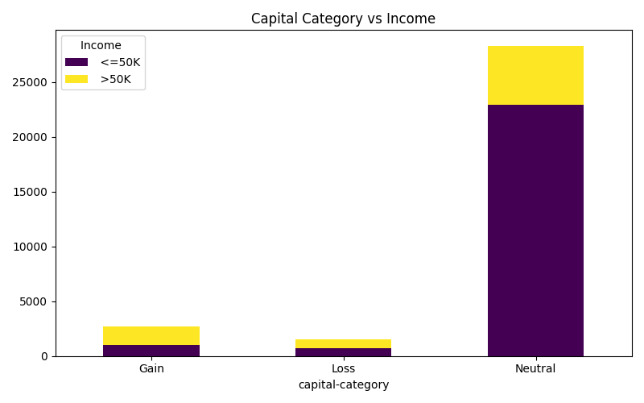

---

### Feature Correlations

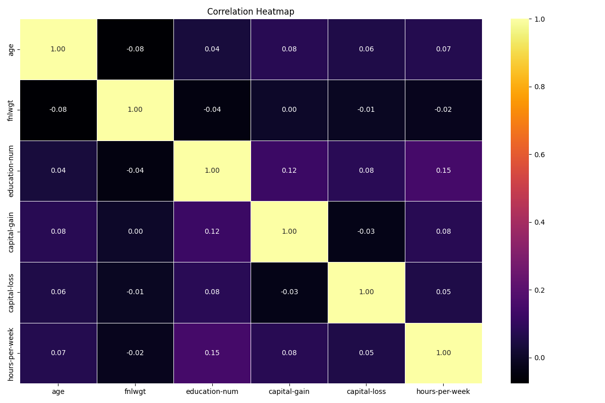

---

### Pairplot Overview

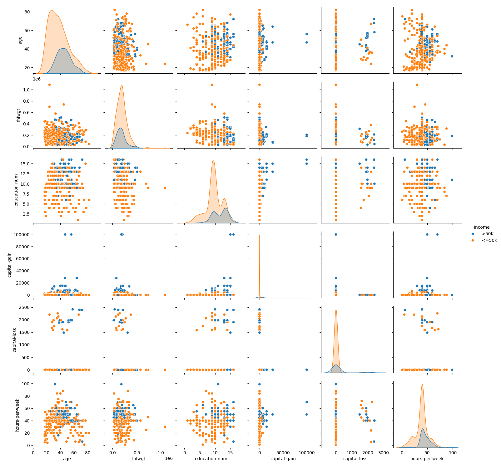

---
## ⚖️ Chi-Square Test Results
The Chi-Square test was utilized to measure the independence of categorical variables relative to **Income**. The results confirm that all listed factors have a statistically significant relationship with the target variable (P-value < 0.05).

| Feature | Chi2 Statistic | P-value | Degrees of Freedom | Relationship |
| :--- | :--- | :--- | :--- | :--- |
| **Marital Status** | 6517.74 | 0.000000 | 6 | **Strong** |
| **Education** | 4429.65 | 0.000000 | 15 | **Strong** |
| **Occupation** | 4031.97 | 0.000000 | 14 | **Strong** |
| **Sex** | 1517.81 | 0.000000 | 1 | **Strong** |

---
## 🔬 3. Statistical Analysis (Post-Preprocessing)

Following the **Pre-processing** phase and the encoding of categorical variables into numerical values, we conducted statistical tests to validate the strength of relationships between features and ensure model reliability.

### 📈 Feature Correlation with Income
This visualization illustrates the **Correlation Coefficient** for each feature relative to **Income**. This helps identify which factors most significantly increase or decrease the probability of an individual earning more than 50K.

  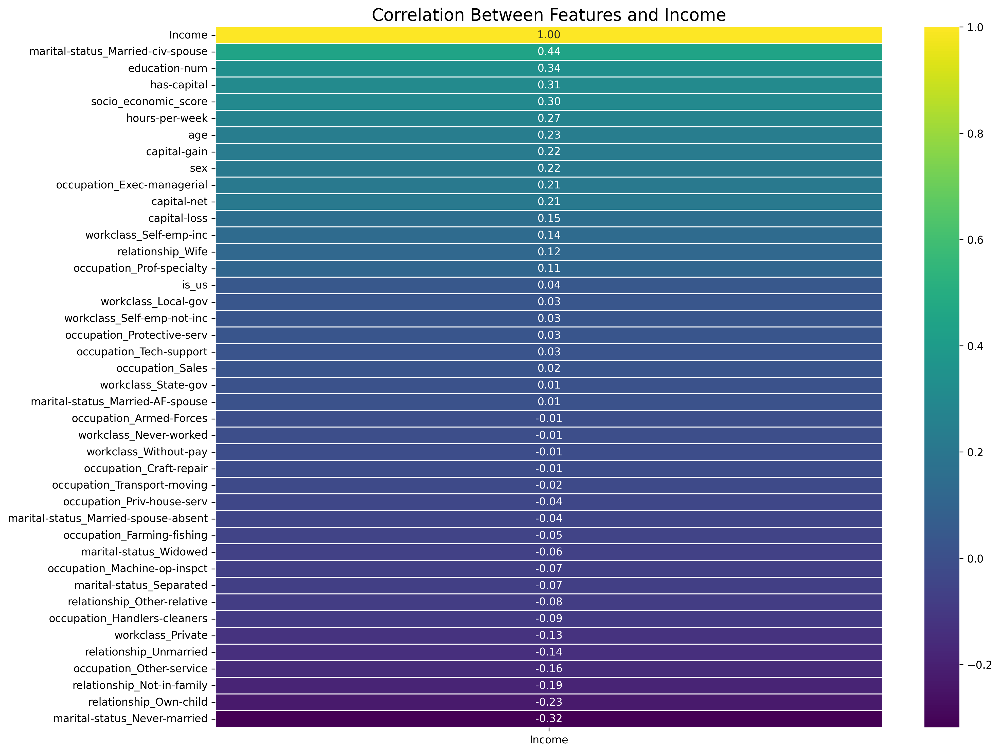
  
<i>Correlation Matrix showing the relationship between features and target (Income)</i>

#### **Key Insights from Correlation:**
*   **Positive Impact:** `Married-civ-spouse` and `education-num` are the strongest factors positively correlated with higher income.
*   **Work & Age:** There is a clear direct correlation between age and the number of working hours per week (`hours-per-week`, `age`) with income levels.
*   **Negative Impact:** `Never-married` and `Own-child` show a strong inverse relationship with high income, which is statistically consistent within this dataset.
 

---

## 🤖 4. Model Training & Evaluation

To evaluate performance across different inductive biases, we trained 6 distinct machine learning models. Each model was evaluated on validation splits before testing.

### 🚀 4.1 XGBoost Classifier (Bonus Model)
* **Overview:** An optimized Gradient Boosting algorithm that learns sequentially by focusing on the classification errors of previous trees.
* **Hyperparameters:** `n_estimators=500`, `max_depth=4`, `learning_rate=0.05`, `subsample=0.7`, `scale_pos_weight=computed_ratio`.
* **Insights:** The dynamic configuration of `scale_pos_weight` directly addressed the $75/25$ class imbalance, boosting F1-score performance while maintaining excellent generalization boundaries.

### 🌲 4.2 Random Forest Classifier (Bonus Model)
* **Overview:** An Ensemble Learning method that constructs 300 decision trees. It excels at identifying non-linear interactions without overfitting.
* **Hyperparameters:** `n_estimators=300`, `max_depth=20`, `min_samples_leaf=2`, `class_weight='balanced'`.
* **Insights:** Averaging 300 different trees successfully neutralized the noise that typically impacts single decision trees. It identified `capital-net`, `marital-status`, and `education-num` as the top 3 most influential features.

### 🔵 4.3 K-Nearest Neighbors (KNN)
* **Overview:** A non-parametric, instance-based algorithm making predictions via majority voting among neighboring points.
* **Hyperparameters:** `n_neighbors=21`, `weights='uniform'`, `metric='minkowski'`, `p=1` (Manhattan Distance).
* **Insights:** Tends to perform solidly around dense class clusters but encounters ambiguity in regions where income classes intermix closely over similar demographic scales.

### 🧠 4.4 Support Vector Machine (SVM)
* **Overview:** Maximizes the geometric margin between classes using non-linear kernels to project the feature space.
* **Hyperparameters:** `kernel='rbf'`, `C=1.0`, `class_weight='balanced'`.
* **Insights:** Extremely scale-sensitive; relying heavily on proper preprocessing (`StandardScaler`) to prevent high-magnitude financial features from overriding key categorical variables.

### 📈 4.5 Logistic Regression
* **Overview:** Serves as our baseline linear model, mapping outcomes to an informative sigmoid probability distribution.
* **Hyperparameters:** `C=1.0`, `class_weight='balanced'`.
* **Insights:** High transparency and clear feature coefficients. However, its strictly linear nature limits its capability to grasp deeper feature-to-feature interactions.

### 🌿 4.6 Decision Tree
* **Overview:** Builds sequential hierarchical if-else decision rules optimized by information gain metrics.
* **Hyperparameters:** `max_depth=10`, `class_weight='balanced'`.
* **Insights:** Highly scalable and scale-invariant (operates efficiently on raw features). The first 3 levels were plotted using `plot_tree` for enhanced model interpretability.

---

---

## 🌐 5. Web Application UI (Screenshots)

Here is a visual overview of our deployed dashboard, model benchmark leaderboards, and user prediction interface:

  <table width="100%">
    <tr>
      <td width="33.3%" align="center">
        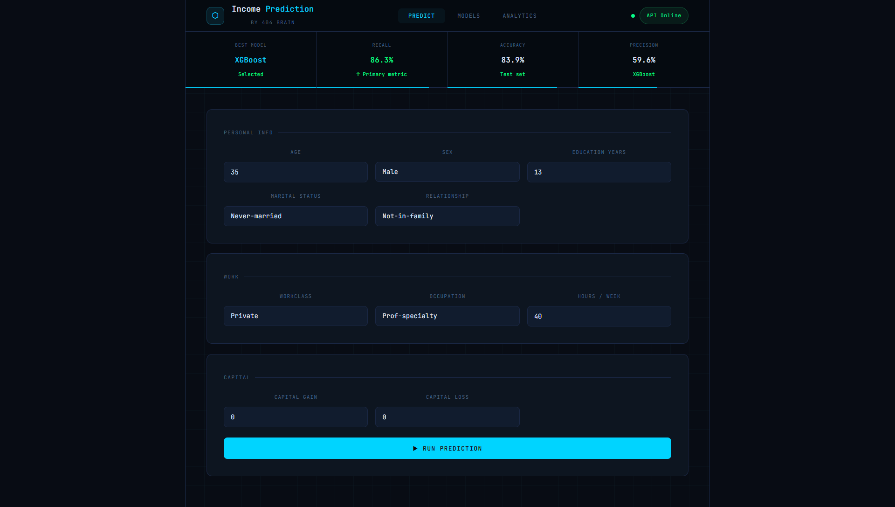
         <b>① Prediction Input Form</b>
      </td>
      <td width="33.3%" align="center">
        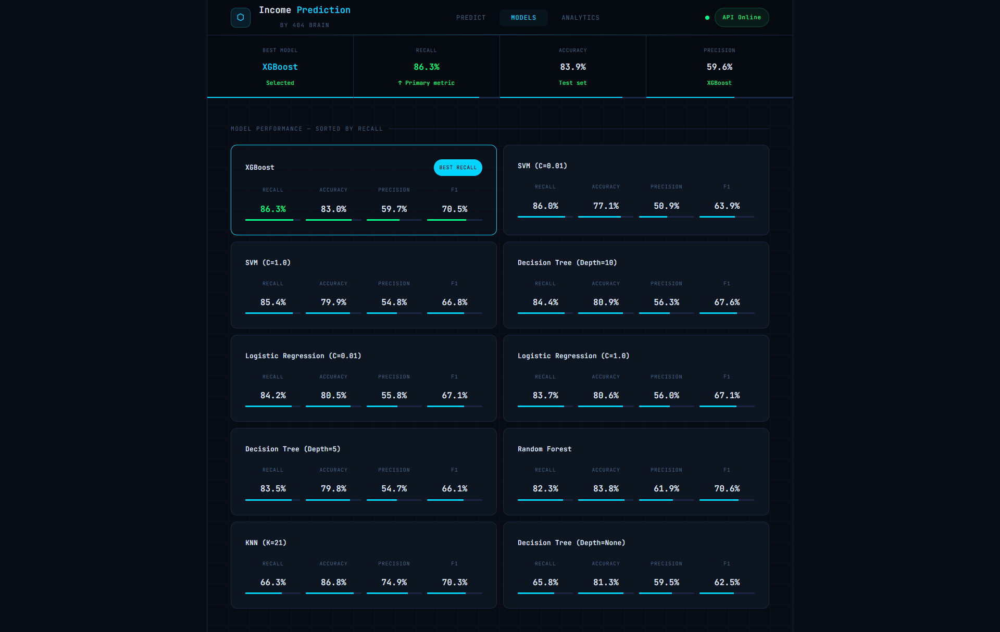
         <b>② Model Performance Dashboard</b>
      </td>
      <td width="33.3%" align="center">
        
         <b>③ Analytics & Insights Tab</b>
      </td>
    </tr>
  </table>

### 💡 Production Notes:
* **The `predict.png` view:** Provides a clean, partitioned interface grouping **Personal Info**, **Work details**, and **Capital** investments to gather real-time data for model evaluation.
* **The `models.png` & `analytics.png` views:** Showcase our dynamic live dashboard where all evaluated algorithms are benchmarked and sorted by **Recall** to prioritize capturing the maximum number of high earners, alongside displaying critical metrics like Accuracy, Precision, and F1-score.

---

## 📄 License

This project is for educational purposes only.

---

> Developed with 💙 as part of Ain Shams University — Faculty of Computer and Information Sciences